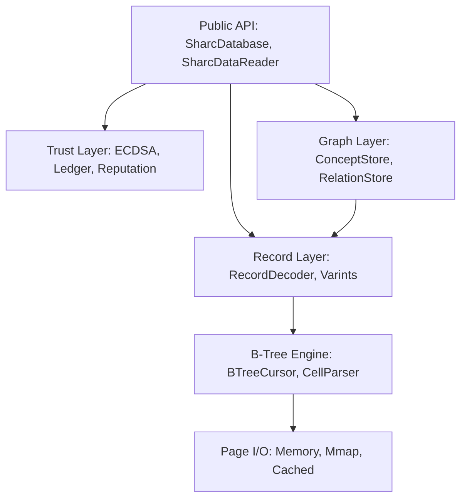

# Sharc Architecture

Sharc is a pure managed SQLite file-format reader and writer. It eliminates the SQL virtual machine (VDBE) and P/Invoke layers to achieve memory speed at the B-tree level.

## Layered Design

## Component Breakdown

- **Trust Layer**: Implements a hash-chain ledger for data provenance. Every entry is signed by an ECDSA agent key.
- **Graph Layer**: Maps standard SQLite tables to a property graph model with O(log N) traversal.
- **Record Decoder**: Uses `ReadOnlySpan<byte>` for zero-allocation decoding of SQLite varints and serial types.
- **B-Tree Engine**: Direct page-level navigation of SQLite B-trees (B-tree and Index pages).
- **Page I/O**: Pluggable backend for memory-mapped files, byte arrays, or custom streams.

## Key Performance Decisions

1. **Zero-Alloc Hot Paths**: All byte-level operations use spans and stack-allocated structs.
2. **SeekFirst(key)**: O(log N) binary search on index B-trees for high-speed relationship navigation.
3. **No SQL Parser**: Eliminates the complexity and overhead of SQL-to-bytecode compilation.
4. **LRU Page Cache**: Amortizes I/O cost for batch operations and graph traversals.

Refer to [PRC/ArchitectureOverview.md](../PRC/ArchitectureOverview.md) for technical deep-dives.
