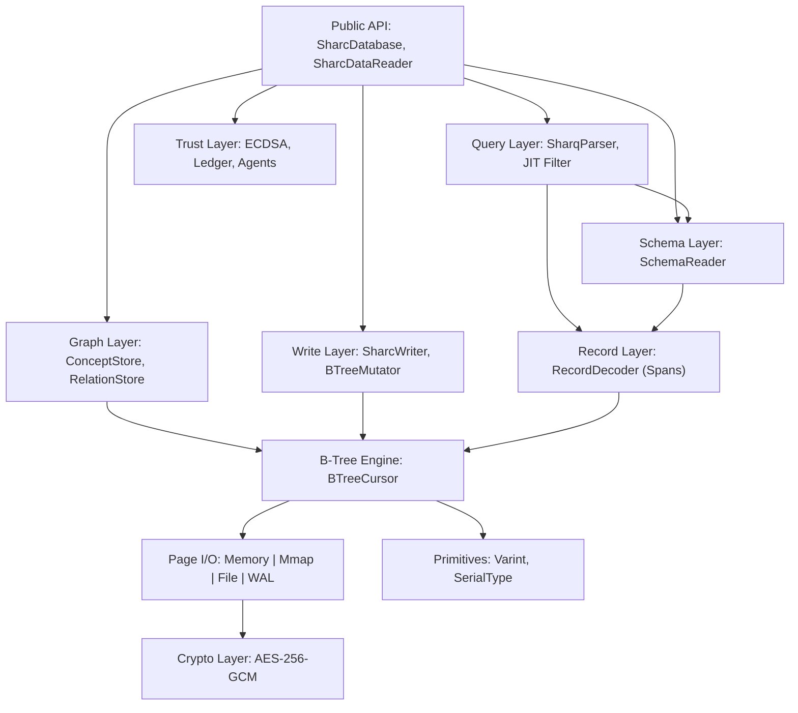

# Sharc Architecture

Sharc is a **Context Engineering Engine** that reads and writes the standard SQLite file format. It bypasses the SQLite library entirely to achieve **2-95x** faster reads and **zero per-row allocations**, enabling high-frequency AI context retrieval.

## Layered Design



## Component Breakdown

| Layer | Responsibility | Key Types |Status |
| :--- | :--- | :--- | :--- |
| **Public API** | Database access, Reader creation | `SharcDatabase`, `SharcDataReader` | Stable |
| **Query Layer** | **Sharq** Parser + **FilterStar** JIT Compiler | `SharqParser`, `SharqTokenizer`, `FilterStarCompiler` | Stable |
| **Graph Layer** | Traversal logic (`\|>`) and Node/Edge storage | `SharcContextGraph`, `ConceptStore`, `RelationStore` | Stable |
| **Trust Layer** | Identity, Ledger management, cryptographic audit | `AgentRegistry`, `LedgerManager`, `EcdsaP256` | Stable |
| **Write Layer** | Full CRUD writes (INSERT/UPDATE/DELETE) | `SharcWriter`, `BTreeMutator` | Stable |
| **Schema Layer** | Parse `sqlite_schema` table | `SchemaReader`, `CreateTableParser` | Stable |
| **Record Layer** | Varint + serial type decode/encode | `RecordDecoder`, `RecordEncoder` | Stable |
| **B-Tree Engine** | Page-level navigation (Table + Index) | `BTreeCursor<T>`, `IndexBTreeCursor<T>` | Stable |
| **Page I/O** | Pluggable page sources + WAL | `FilePageSource`, `WalReader`, `MemoryMappedPageSource` | Stable |
| **Crypto** | Page-level encryption | `AesGcmPageTransform`, `Argon2idKdf` | Stable |

## Why Sharc Is Fast

Sharc eliminates the "General Purpose Tax" of SQLite:

| Optimization | Impact |
| :--- | :--- |
| **No P/Invoke** | Saves ~200ns per call. Compounds to milliseconds over 10k rows. |
| **Simd Tokenizer** | `SharqTokenizer` uses .NET 8 `SearchValues<char>` to scan queries at GB/s. |
| **JIT Filtering** | `FilterStarCompiler` emits dynamic IL delegates for predicates, beating interpreted bytecode. |
| **Zero Allocation** | `RecordDecoder` uses `ref struct` and `Span<T>` to read directly from page buffers. |
| **O(1) Column Access** | `ComputeColumnOffsets()` precomputes all column byte offsets once per row in O(K), then each column access is O(1) via precomputed offset — eliminates O(K²) per-row overhead. |
| **Graph Indexing** | `RelationStore` uses O(log N) B-tree seeks instead of recursive SQL joins. Two-phase BFS + zero-alloc cursor achieves 31x speedup. |

## Key Design Decisions

| Decision | Rationale |
| :--- | :--- |
| **Sharq vs SQL** | We built a custom recursive descent parser (`Sharq`) to support Graph syntax (`\|>`) and avoid the overhead of a full SQL engine. |
| **ReadOnlySpan<byte>** | The entire read pipeline is allocation-free. Data is never copied until the user asks for a string. |
| **Trust Ledger** | We embed a hash-chain ledger directly in the `.sharc` file to make AI memory verifiable. |
| **Single-Writer** | We sacrificed concurrency for simplicity and codebase size (<50KB). |

## Project Structure

```text
src/Sharc/                    Public API
src/Sharc.Core/               Internal Engine (B-Tree, IO, Records)
src/Sharc.Query/              Sharq Parser & JIT Compiler
src/Sharc.Graph/              Graph Logic & Stores
src/Sharc.Graph.Surface/      Graph Interfaces
src/Sharc.Crypto/             Encryption
tests/                        2,260 Unit & Integration Tests
bench/                        BenchmarkDotNet Suite
tools/                        CLI & Context Tools
```

