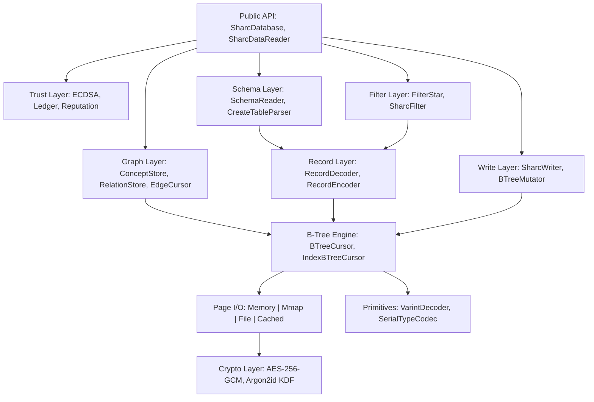

# Sharc Architecture

Sharc is a pure managed SQLite file-format reader and writer. No VM, no VDBE, no query planner -- just B-tree pages decoded through zero-alloc spans, with a cryptographic trust layer for AI agents.

## Layered Design



## Component Breakdown

| Layer | Responsibility | Key Types |
| :--- | :--- | :--- |
| **Public API** | Database open/close, reader creation, schema access | `SharcDatabase`, `SharcDataReader`, `SharcOpenOptions` |
| **Write Layer** | INSERT with B-tree page splits, ACID transactions | `SharcWriter`, `WriteEngine`, `BTreeMutator`, `Transaction` |
| **Trust Layer** | Agent identity, hash-chain audit, reputation scoring | `AgentRegistry`, `LedgerManager`, `ReputationEngine` |
| **Graph Layer** | Concept/relation stores, BFS traversal, edge cursors | `SharcContextGraph`, `ConceptStore`, `RelationStore`, `EdgeCursor` |
| **Filter Layer** | WHERE-style predicates on raw page bytes | `FilterStar`, `SharcFilter`, `FilterEvaluator` |
| **Schema Layer** | Parse `sqlite_schema` table, column introspection | `SchemaReader`, `CreateTableParser`, `TableInfo`, `ColumnInfo` |
| **Record Layer** | Varint + serial type decode/encode to typed values | `RecordDecoder`, `RecordEncoder`, `CellBuilder` |
| **B-Tree Engine** | Page-level B-tree navigation (table + index) | `BTreeCursor`, `IndexBTreeCursor`, `CellParser` |
| **Page I/O** | Pluggable page sources with LRU caching | `FilePageSource`, `MemoryPageSource`, `CachedPageSource` |
| **Crypto** | Page-level encryption, key derivation | `AesGcmPageTransform`, `SharcKeyHandle`, `Argon2idKdf` |
| **Primitives** | Zero-alloc byte-level operations | `VarintDecoder`, `SerialTypeCodec`, `DatabaseHeader` |

## Why Sharc Is Fast

Sharc eliminates entire layers that SQLite pays for on every query:

| Layer Eliminated | Impact |
| :--- | :--- |
| P/Invoke boundary | ~200 ns per call; compounds to milliseconds over thousands of rows |
| SQL parser | Eliminated entirely -- no text to parse |
| VDBE interpreter | Eliminated -- direct B-tree descent replaces bytecode execution |
| Per-row object allocation | `ArrayPool<ColumnValue>` -- the GC doesn't wake up during reads |
| String marshalling | `ReadOnlySpan<byte>` or direct UTF-8 decode from page span |

The seek path comparison illustrates this concretely:

```text
SQLite Seek Path (21,193 ns):
  C# > P/Invoke > sqlite3_prepare > SQL parse > VDBE compile >
  sqlite3_step > B-tree descend > read leaf > VDBE decode >
  P/Invoke return > marshal to managed objects

Sharc Seek Path (637 ns):
  Span<byte> > B-tree page > binary search > leaf cell > decode value
```

## Key Design Decisions

| Decision | Rationale |
| :--- | :--- |
| `ReadOnlySpan<byte>` everywhere | Zero-alloc decode pipeline -- no boxing, no GC pressure |
| `ColumnValue[]` buffer pooling | `ArrayPool` -- rent once per reader, return on dispose |
| No SQL parser | Eliminates ~80% of SQLite's codebase |
| LRU page cache | B-tree interior pages reused across seeks -- batch lookups amortize I/O |
| `SeekFirst(key)` on index cursor | O(log N) binary search on index B-tree -- enables 13.5x graph traversal speedup |
| Page-level AES-256-GCM | Encryption at the storage layer, transparent to readers |
| `IBTreeCursor.Reset()` | Persistent cursor reuse eliminates per-traversal allocation in graph layer |

## Project Structure

```text
src/Sharc/                    Public API (SharcDatabase, SharcDataReader, Schema, Trust, Write)
src/Sharc.Core/               Internal: page I/O, B-tree, record decoding, primitives
src/Sharc.Graph/              Graph storage layer (ConceptStore, RelationStore, EdgeCursor)
src/Sharc.Graph.Surface/      Graph interfaces and models (IEdgeCursor, TraversalPolicy)
src/Sharc.Crypto/             Encryption: AES-256-GCM, Argon2id KDF
src/Sharc.Arena.Wasm/         Live browser benchmark arena (Blazor WASM)
tests/Sharc.Tests/            Unit tests (832 tests)
tests/Sharc.IntegrationTests/ End-to-end tests (146 tests)
tests/Sharc.Graph.Tests.Unit/ Graph layer unit tests (53 tests)
tests/Sharc.Context.Tests/    MCP context query tests (14 tests)
tests/Sharc.Index.Tests/      GCD indexer tests (22 tests)
bench/Sharc.Benchmarks/       BenchmarkDotNet comparative suite
bench/Sharc.Comparisons/      Graph + core benchmarks
tools/Sharc.Context/          MCP server: AI agent query tools
tools/Sharc.Index/            CLI: builds GitHub Context Database
```

## Further Reading

- [Benchmarks](BENCHMARKS.md) -- Full performance data with methodology
- [PRC/ArchitectureOverview.md](../PRC/ArchitectureOverview.md) -- Technical deep-dives
- [Getting Started](GETTING_STARTED.md) -- Usage patterns
